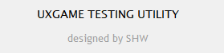
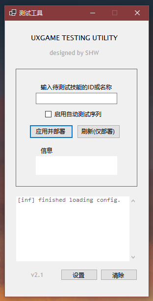

# UxGame-Testing-Utility 中文文档
To view English document, please access on: https://translate.google.com/

UxGame 的自动化测试工具, 基于Winform提供GUI, 并具有与Unity引擎联动的Socket客户端.  通过编写自定义的服务端程序, UxTU能自动化执行丰富多样的测试行为, 即使程序位于Unity内部.

An automatically testcase deployer and stats recorder for UxGame project. It provides GUI and friendly unity platform support. By using UxTU-API, It can execute custom testing action automatically.

Note: 测试工具不包括项目数据文件.



## 快速开始

您可以在Release中直接下载UxTU客户端的最新版本.

> [Release v2.1 release · SHthemW/UxGame-Testing-Utility (github.com)](https://github.com/SHthemW/UxGame-Testing-Utility/releases/tag/Release)

此外, 您也可以通过clone源代码来调试和运行程序:

```
git clone https://github.com/SHthemW/UxGame-Testing-Utility.git
```

注意: 要调试源代码, 您的计算机需要具有.Net 6.0 开发环境.

客户端程序通常*无法*独立实现功能. 您需要在Unity引擎内部开发配套的服务端程序. 服务端将基于本地的Socket服务器与UxTU客户端建立连接, 并接收特定协议的命令执行操作.

## 界面

UxTU的主界面如图所示(文本内容仅为示例):



## 客户端API

您可以通过API编程来实现需要的功能. UxTU内置了客户端Action的编程接口:

>  v2.1 Note: 当前Action的开发-运行模式不能很好的维护开闭原则. 除非必要, 您应当等待新版本的UxTU和更完善的ActionAPI发布.

```c#
namespace UxGame_Testing_Utility.Actions
{
    internal abstract class ExecutableAction
    {
        protected readonly IMainWindowService _program;

        public ExecutableAction(IMainWindowService program)
        {
            _program = program ?? throw new ArgumentNullException(nameof(program));
        }

        public abstract Task Execute();

        private ExecutableAction() => throw new NotImplementedException();
    }
}
```

接口```IMainWindowService```提供主面板文本框的输入信息和Console服务. 您可以根据此实现捕获主面板中用户输入的数据, 并执行特定的操作. 

在主窗口类```MainWindow```中, 您可以实例化Action并执行它们. 下面是一个示例:

```c#
private async void ApplyAndDeployBtn_Click(object sender, EventArgs e)
{
    try
    {
        // init action
        ExecutableAction replaceData = new ReplaceDataInTableAction (this);
        ExecutableAction callRefresh = new CallRefreshCommandAction (this);
        ExecutableAction callAutoTst = new CallAutoTestCommandAction(this);
        
        var actions = new ExecutableAction[] {replaceData, callRefresh, callAutoTst};

        // execute
        foreach (var action in actions)
        {
            await action.Execute();
        }
    }
    catch (Exception ex)
    {
        _consLogger.ShowLog(ex.Message, LogLevel.err);
    }
}
```

这个示例中, ```ReplaceDataInTableAction```, ```CallRefreshCommandAction```和```CallAutoTestCommandAction```都是根据API编写的自定义行为.  点击主界面的Click按钮将会以此执行它们.
